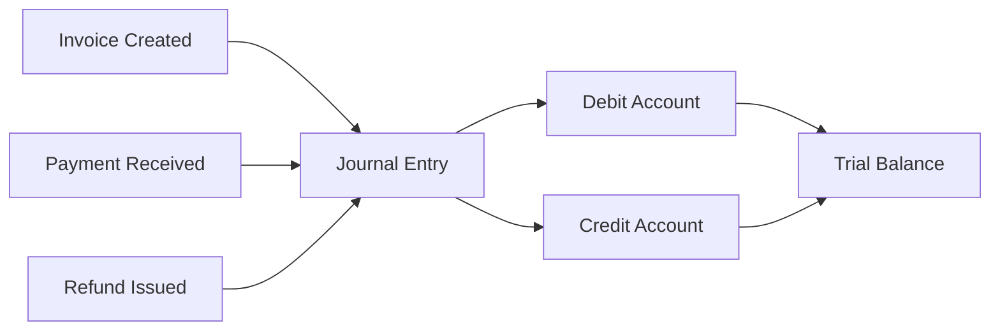
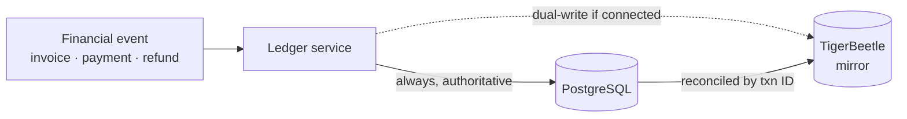
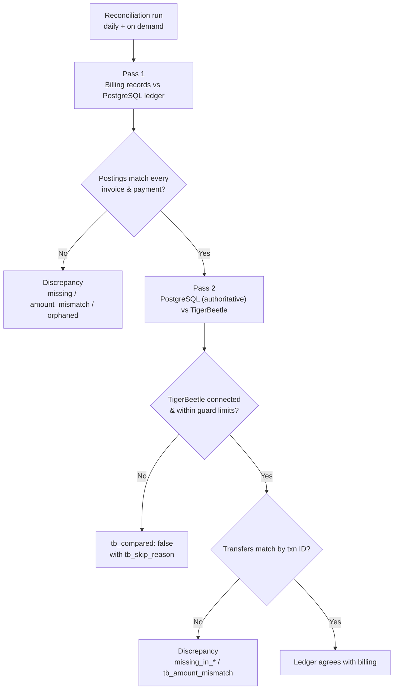

## Overview

Recurso includes a built-in double-entry ledger that automatically records journal entries for every financial event — payments, invoices, refunds, and more. Every transaction creates balanced debits and credits, giving you an auditable, real-time view of your financial position.



### Why Double-Entry?

- **Accuracy** — Every transaction balances to zero. If debits do not equal credits, the entry is rejected.
- **Auditability** — Full history of every financial movement, tied back to source objects (invoices, payments, refunds).
- **Reporting** — Generate balance sheets, income statements, and cash flow reports directly from the ledger.
- **Compliance** — Meets requirements for ASC 606 revenue recognition and standard accounting principles.

## Account Types

Recurso organizes ledger accounts into five standard accounting categories:

| Type | Description | Normal Balance | Example |
|------|-------------|----------------|---------|
| `asset` | Resources owned | Debit | Cash, Accounts Receivable |
| `liability` | Obligations owed | Credit | Deferred Revenue, Tax Payable |
| `equity` | Owner's stake | Credit | Retained Earnings |
| `revenue` | Income earned | Credit | Subscription Revenue |
| `expense` | Costs incurred | Debit | Refunds, Credits & Adjustments |

## Built-in Account Codes

Recurso provisions the following accounts automatically for each tenant:

| Account Code | Name | Type | Purpose |
|-------------|------|------|---------|
| `1000` | Cash | `asset` | Funds received from payments |
| `1100` | Accounts Receivable | `asset` | Outstanding invoice amounts |
| `1200` | TDS Receivable | `asset` | Tax withheld at source, recoverable |
| `2100` | Deferred Revenue | `liability` | Billed revenue not yet earned |
| `2200` | Tax Payable | `liability` | Collected tax awaiting remittance |
| `2300` | Customer Credit | `liability` | Account credit owed back to a customer |
| `4000` | Revenue | `revenue` | Revenue billed on issuance (one-off charges credit here directly) |
| `4100` | Recognized Revenue | `revenue` | Deferred revenue earned as the service period elapses |
| `5000` | Refunds | `expense` | Refund amounts issued to customers |
| `5100` | Credits & Adjustments | `expense` | Issued, expired, or written-off account credit |
| `5200` | Bad Debt Expense | `expense` | Invoices written off as uncollectible |

<Info>
Account codes follow standard chart-of-accounts conventions. Assets start with `1xxx`, liabilities with `2xxx`, revenue with `4xxx`, and expenses with `5xxx`.
</Info>

<Note>
  Recurso's ledger is **transfer-based**: every posting is exactly one debit
  account, one credit account, and a positive amount in minor units — never a
  multi-leg compound entry. A multi-account event (an invoice with tax, say) is
  recorded as *several* single-debit/single-credit transfers, each with its own
  `code`. The tables below show each transfer on its own line.
</Note>

## How Transactions Are Created

Recurso automatically creates journal entries when financial events occur. You never need to create entries manually — they are produced as a side effect of normal billing operations.

### Invoice Finalized

When an invoice is finalized, Recurso records the amount owed as a single
transfer (posting `code` `1`) at the **gross** invoice total. The credit side
depends on what was billed:

- **Subscription invoice** → credit `2100` Deferred Revenue (earned over the period)
- **One-off charge** → credit `4000` Revenue directly (earned on issuance)

```
Debit   1100 (Accounts Receivable)   ₹4,999.00
Credit  2100 (Deferred Revenue)      ₹4,999.00
```

### Payment Received

When the customer pays the invoice:

```
Debit   1000 (Cash)                  ₹4,999.00
Credit  1100 (Accounts Receivable)   ₹4,999.00
```

Across both events the postings balance — every debit is matched by an equal
credit, and Accounts Receivable nets back to zero once the invoice is paid:


### Revenue Recognized

As the subscription period elapses, deferred revenue moves into **Recognized
Revenue** (posting `code` `2`) — recognition credits `4100`, not `4000`:

```
Debit   2100 (Deferred Revenue)       ₹4,999.00
Credit  4100 (Recognized Revenue)     ₹4,999.00
```

### Refund Issued

When a refund is processed (posting `code` `4`):

```
Debit   5000 (Refunds)               ₹4,999.00
Credit  1000 (Cash)                  ₹4,999.00
```

### Tax on an Invoice

Recurso does **not** post tax as a separate debit to Accounts Receivable — the
Code-1 issuance transfer already books the **gross** amount (net + tax) to AR.
A second transfer (posting `code` `6`) then reclassifies the tax portion out of
revenue and into Tax Payable, so revenue reflects only the taxable value.

For a subscription invoice of ₹4,999 gross that includes ₹762.55 of tax:

```
Code 1  Debit  1100 (Accounts Receivable)  ₹4,999.00
        Credit 2100 (Deferred Revenue)     ₹4,999.00

Code 6  Debit  2100 (Deferred Revenue)     ₹762.55
        Credit 2200 (Tax Payable)          ₹762.55
```

Net effect: AR ₹4,999 (gross), Deferred Revenue ₹4,236.45 (taxable value), Tax
Payable ₹762.55. For a one-off charge the Code-6 debit falls on `4000` Revenue
instead of `2100` Deferred Revenue.

### Discounts and Coupons

There is **no** separate discount posting. A coupon or discount reduces the
invoice total *before* the Code-1 transfer, so the ledger simply books the
already-discounted gross to Accounts Receivable. (Account `5100` Credits &
Adjustments is used for *account credit* — issued, expired, or written off — not
for line-item discounts.)

## Querying the Ledger

### List Ledger Accounts

Retrieve all ledger accounts and their current balances.

<CodeGroup>
```typescript TypeScript
const accounts = await recurso.ledger.accounts.list();

// Response
{
  data: [
    {
      id: "lacc_abc123",
      tenant_id: "ten_xyz",
      code: "1000",
      name: "Cash",
      type: "asset",
      balance: 2450000,
      currency: "INR"
    },
    {
      id: "lacc_def456",
      tenant_id: "ten_xyz",
      code: "1100",
      name: "Accounts Receivable",
      type: "asset",
      balance: 875000,
      currency: "INR"
    },
    {
      id: "lacc_ghi789",
      tenant_id: "ten_xyz",
      code: "4000",
      name: "Revenue",
      type: "revenue",
      balance: 1250000,
      currency: "INR"
    }
  ]
}
```

```bash cURL
curl https://api.recurso.dev/v1/ledger/accounts \
  -H "Authorization: Bearer $API_KEY"
```
</CodeGroup>

### List Journal Entries

The ledger is queried **one account at a time**, so `account_id` is required.
Each row is a single balanced transfer (one debit account, one credit account,
one positive amount). Narrow to a posting kind with `code`, and page with
`limit` / `offset`. See the [List Ledger Entries reference](/api-reference/ledger/entries)
for the full parameter and field list.

<CodeGroup>
```typescript TypeScript
const entries = await recurso.ledger.entries.list({
  account_id: "lacc_abc123",
  code: 3,          // optional: only payment postings
  limit: 50
});

// Response
{
  data: [
    {
      id: "ltxn_abc123",
      tenant_id: "ten_xyz",
      debit_account_id: "lacc_cash1000",
      credit_account_id: "lacc_ar1100",
      amount: 499900,
      code: 3,
      description: "Payment received for inv_m8k29x",
      reference_type: "payment",
      reference_id: "pay_r4t78p",
      created_at: "2025-01-15T10:30:00Z"
    }
  ]
}
```

```bash cURL
curl "https://api.recurso.dev/v1/ledger/entries?account_id=lacc_abc123&code=3&limit=50" \
  -H "Authorization: Bearer $API_KEY"
```
</CodeGroup>

<Note>
  There are no `start_date` / `end_date` filters on this endpoint. To pull a full
  period across every account, use the [General Ledger export](/api-reference/ledger/export);
  to read every posting behind one invoice, use its journal entries.
</Note>

### Entry Filter Parameters

| Parameter | Type | Description |
|-----------|------|-------------|
| `account_id` | `string` | **Required.** The account whose postings to list |
| `code` | `integer` | Optional. Restrict to one posting kind (`1` = issuance, `3` = payment, `6` = tax reclass, …) |
| `limit` | `integer` | Optional. Page size |
| `offset` | `integer` | Optional. Page offset |

### LedgerAccount Object

| Field | Type | Description |
|-------|------|-------------|
| `id` | `string` | Unique identifier (prefixed `lacc_`) |
| `tenant_id` | `string` | Tenant this account belongs to |
| `code` | `string` | Numeric account code (e.g., `1000`) |
| `name` | `string` | Human-readable account name |
| `type` | `string` | One of `asset`, `liability`, `equity`, `revenue`, `expense` |
| `balance` | `integer` | Current balance in minor units |
| `currency` | `string` | ISO 4217 currency code |

### LedgerTransaction Object

Each transaction is one balanced transfer — a single debit account, a single
credit account, and a positive amount. There is no nested `entries[]` array.

| Field | Type | Description |
|-------|------|-------------|
| `id` | `string` | Unique identifier (prefixed `ltxn_`) |
| `tenant_id` | `string` | Tenant this transaction belongs to |
| `debit_account_id` | `string` | Account being debited |
| `credit_account_id` | `string` | Account being credited |
| `amount` | `integer` | Amount in minor currency units (always positive) |
| `code` | `integer` | Posting kind (`1` = issuance, `2` = recognition, `3` = payment, `6` = tax reclass, …) |
| `description` | `string` | Human-readable description of the transaction |
| `reference_type` | `string` | Source object type (e.g., `payment`, `invoice`, `refund`) |
| `reference_id` | `string` | ID of the source object |
| `created_at` | `string` | ISO 8601 timestamp |

## TigerBeetle Backend

For high-throughput environments, Recurso supports an optional [TigerBeetle](https://tigerbeetle.com) backend. TigerBeetle is a purpose-built financial transactions database that provides:

- **Sub-millisecond latency** for ledger operations
- **Strict serializability** guaranteeing consistency
- **Built-in two-phase transfers** for complex settlement flows
- **Throughput** exceeding 1 million transactions per second

<Tip>
TigerBeetle is optional. The default PostgreSQL-backed ledger handles most workloads. Consider TigerBeetle if you process more than 10,000 transactions per minute or need sub-millisecond ledger writes.
</Tip>

To enable TigerBeetle, point Recurso at a reachable cluster address:

```bash .env
TIGERBEETLE_ADDRESS=127.0.0.1:3001
```

`TIGERBEETLE_ADDRESS` is the only setting — the cluster ID is `0`. On boot,
Recurso connects if the address is reachable and mirrors postings to it; if the
connection fails it logs `TigerBeetle not connected — ledger PG-only mode` and
runs on Postgres alone. There is no separate backend toggle.

Every posting is **dual-written**: PostgreSQL is written first and is always
authoritative; when TigerBeetle is connected, the same transfer is mirrored to it
by transaction ID. If TigerBeetle is unavailable, Postgres still holds the
complete, correct ledger.



The API surface remains identical — switching backends requires no changes to your integration code.

## Reconciliation

The reconciliation report answers "does the ledger agree with the billing
records?" for your tenant. Run it on demand with
[`GET /v1/finance/reconciliation`](/api-reference/finance/reconciliation);
a scheduler also runs it **daily** and logs
`Ledger reconciliation found discrepancies` when drift appears. The plain
`GET` report is computed fresh and read-only — it never writes to the ledger,
and fixing drift is a human decision. If you want an audit trail of *when*
reconciliation ran and what it found, `POST /v1/finance/reconciliation/runs`
runs the same check and records a summary row you can list later; the
underlying report is still read-only.

```bash
curl https://api.recurso.dev/v1/finance/reconciliation \
  -H "Authorization: Bearer $API_KEY"
```



Two passes run:

1. **Billing records vs. PostgreSQL ledger** — every non-draft invoice must
   have invoice postings summing to its total, every paid invoice must have
   payment postings summing to its amount paid, and every such posting must
   reference an existing invoice.
2. **PostgreSQL ledger vs. TigerBeetle** (when connected) — the tenant's
   Postgres ledger transactions (authoritative) are diffed against the
   enumerated TigerBeetle transfers by transaction ID.

### Discrepancy types

| Type | Comparison | Meaning |
|------|------------|---------|
| `missing_invoice_transaction` | Billing ↔ Postgres | A non-draft invoice has no ledger posting |
| `invoice_amount_mismatch` | Billing ↔ Postgres | Invoice postings do not sum to the invoice total |
| `missing_payment_transaction` | Billing ↔ Postgres | A paid invoice has no payment posting |
| `payment_amount_mismatch` | Billing ↔ Postgres | Payment postings do not sum to the amount paid |
| `orphaned_transaction` | Billing ↔ Postgres | A ledger posting references an invoice that does not exist |
| `missing_in_tigerbeetle` | Postgres ↔ TigerBeetle | A Postgres ledger transaction has no TigerBeetle transfer |
| `missing_in_postgres` | Postgres ↔ TigerBeetle | A TigerBeetle transfer has no Postgres ledger transaction |
| `tb_amount_mismatch` | Postgres ↔ TigerBeetle | Same transaction ID, different amounts |

### `tb_compared` and `tb_skip_reason`

The TigerBeetle pass is best-effort and always honest: when it cannot run,
the report sets `tb_compared: false` with the reason in `tb_skip_reason`
instead of failing. Skip reasons you may see:

- TigerBeetle is not configured or the client is not connected (normal for
  Postgres-only deployments — Postgres is the authoritative ledger)
- The tenant has more than 100,000 ledger transactions or transfers, above
  the in-memory comparison guard
- Enumerating transfers or loading transaction summaries failed

When the pass runs, `tb_compared` is `true` and `tb_accounts_checked` /
`tb_transfers_checked` report its scope.

<Info>
The report lists at most 100 discrepancies (`truncated: true` when more
exist); `total_discrepancies` always carries the full count.
</Info>

## Webhook Events

<Note>
  The ledger does **not** emit its own webhook events — there are no
  `ledger.entry.created` or `ledger.account.balance_updated` events. Recurso
  emits ten event types (invoice, subscription, customer, and payment
  lifecycle); see the [Webhook Events reference](/api-reference/webhooks/events).
  To watch ledger movement, poll an account's postings or the reconciliation
  report.
</Note>

## Best Practices

<CardGroup cols={2}>
  <Card title="Use Reference IDs" icon="link">
    Always trace ledger entries back to their source invoice, payment, or refund using `reference_type` and `reference_id`
  </Card>
  <Card title="Reconcile Regularly" icon="scale-balanced">
    Compare ledger balances against your payment gateway settlements weekly to catch discrepancies early
  </Card>
  <Card title="Monitor Imbalances" icon="triangle-exclamation">
    Set alerts on the trial balance. Any non-zero difference indicates a bug or data corruption
  </Card>
  <Card title="Export for the Warehouse" icon="box-archive">
    Use the [General Ledger export](/api-reference/ledger/export) to pull a full period across all accounts into your data warehouse for long-term storage and reporting
  </Card>
</CardGroup>

<Warning>
Ledger entries are immutable. To correct an error, create a reversing entry (debit and credit swapped) rather than deleting or modifying the original transaction.
</Warning>
