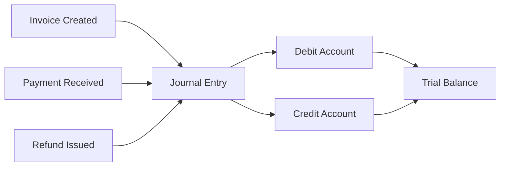
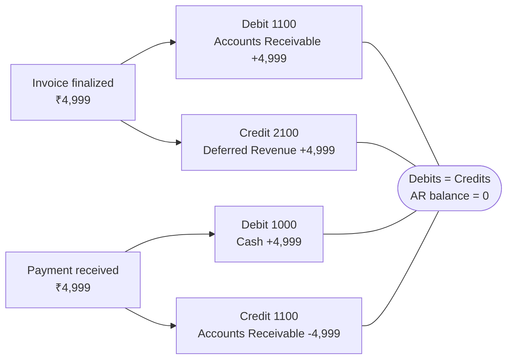
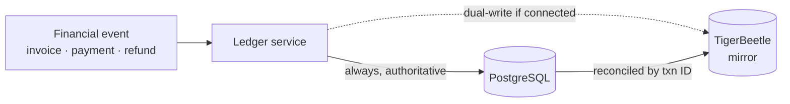
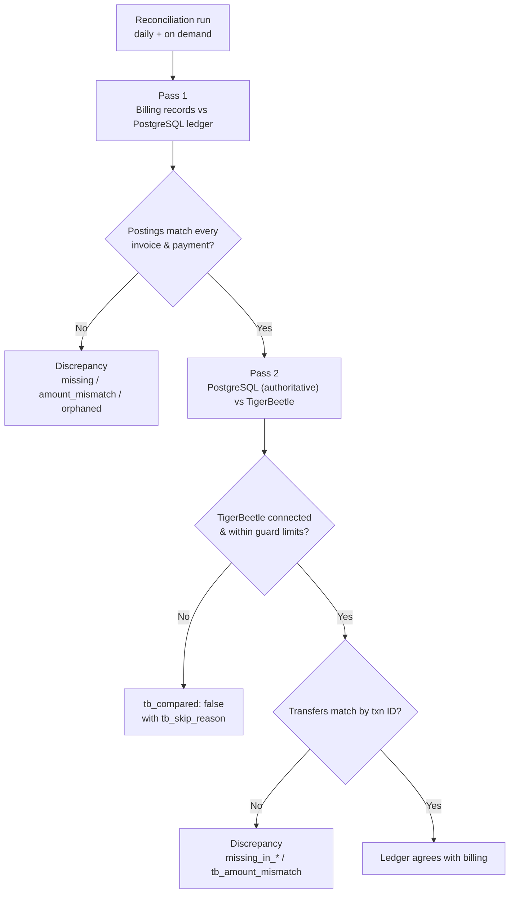

## Overview

Recurso includes a built-in double-entry ledger that automatically records journal entries for every financial event — payments, invoices, refunds, and more. Every transaction creates balanced debits and credits, giving you an auditable, real-time view of your financial position.



### Why Double-Entry?

- **Accuracy** — Every transaction balances to zero. If debits do not equal credits, the entry is rejected.
- **Auditability** — Full history of every financial movement, tied back to source objects (invoices, payments, refunds).
- **Reporting** — Generate balance sheets, income statements, and cash flow reports directly from the ledger.
- **Compliance** — Meets requirements for ASC 606 revenue recognition and standard accounting principles.

## Account Types

Recurso organizes ledger accounts into five standard accounting categories:

| Type | Description | Normal Balance | Example |
|------|-------------|----------------|---------|
| `asset` | Resources owned | Debit | Cash, Accounts Receivable |
| `liability` | Obligations owed | Credit | Deferred Revenue, Tax Payable |
| `equity` | Owner's stake | Credit | Retained Earnings |
| `revenue` | Income earned | Credit | Subscription Revenue |
| `expense` | Costs incurred | Debit | Refunds, Credits & Adjustments |

## Built-in Account Codes

Recurso provisions the following accounts automatically for each tenant:

| Account Code | Name | Type | Purpose |
|-------------|------|------|---------|
| `1000` | Cash | `asset` | Funds received from payments |
| `1100` | Accounts Receivable | `asset` | Outstanding invoice amounts |
| `1200` | TDS Receivable | `asset` | Tax deducted at source by customers (India), recoverable |
| `2100` | Deferred Revenue | `liability` | Billed subscription revenue not yet earned |
| `2200` | Tax Payable | `liability` | Collected tax awaiting remittance |
| `2300` | Customer Credit | `liability` | Account credit and wallet balance owed to customers |
| `4000` | Revenue | `revenue` | One-off charges, earned immediately |
| `4100` | Recognized Revenue | `revenue` | Subscription revenue earned on schedule out of Deferred |
| `5000` | Refunds | `expense` | Refund amounts issued to customers |
| `5100` | Credits & Adjustments | `expense` | Cost of issued/expired account credit |
| `5200` | Bad Debt Expense | `expense` | Recognized revenue written off as uncollectible |

<Info>
Account codes follow standard chart-of-accounts conventions. Assets start with `1xxx`, liabilities with `2xxx`, revenue with `4xxx`, and expenses with `5xxx`.
</Info>

## How Transactions Are Created

Recurso automatically creates journal entries when financial events occur. You never need to create entries manually — they are produced as a side effect of normal billing operations.

### Invoice Finalized

When an invoice is finalized, Recurso records the amount owed:

```
Debit   1100 (Accounts Receivable)   ₹4,999.00
Credit  2100 (Deferred Revenue)      ₹4,999.00
```

### Payment Received

When the customer pays the invoice:

```
Debit   1000 (Cash)                  ₹4,999.00
Credit  1100 (Accounts Receivable)   ₹4,999.00
```

Across both events the postings balance — every debit is matched by an equal
credit, and Accounts Receivable nets back to zero once the invoice is paid:



### Revenue Recognized

As the subscription period elapses, the scheduler earns deferred revenue
month by month:

```
Debit   2100 (Deferred Revenue)      ₹4,999.00
Credit  4100 (Recognized Revenue)    ₹4,999.00
```

One-off (non-subscription) invoices skip deferral entirely — their Code-1
entry credits `4000 Revenue` directly, because the charge is earned the
moment it is billed.

### Refund Issued

When a refund is processed:

```
Debit   5000 (Refunds)               ₹4,999.00
Credit  1000 (Cash)                  ₹4,999.00
```

### Tax Collected

The invoice entry (Code 1) posts the GROSS total to Accounts Receivable, so
the tax portion starts inside Deferred Revenue. A separate reclass entry
(Code 6) moves it to its own liability — note it debits Deferred, **not**
AR, which already carries the gross amount:

```
Debit   2100 (Deferred Revenue)      ₹899.82
Credit  2200 (Tax Payable)           ₹899.82
```

(For a one-off invoice the reclass debits `4000 Revenue` instead.)

### Discounts

Discounts do not post their own entry. A coupon reduces the invoice total
before Code 1 posts, so the ledger simply records the smaller gross amount —
there is nothing separate to reclass.

## Querying the Ledger

### List Ledger Accounts

Retrieve all ledger accounts and their current balances.

<CodeGroup>
```typescript TypeScript
const accounts = await recurso.ledger.accounts();

// Response
{
  data: [
    {
      id: "b3a1c9e7-2f4d-4a8b-9c6e-1d5f7a2b8c30",
      tenant_id: "b7d91c25-4e8a-4f3b-a6d2-9c0e1f5a7b83",
      code: 1000,
      name: "Cash",
      type: "asset",
      balance: 2450000,
      currency: "INR"
    },
    {
      id: "e8f2d6b4-9a1c-4e7f-b3d5-6c8a0e2f4b19",
      tenant_id: "b7d91c25-4e8a-4f3b-a6d2-9c0e1f5a7b83",
      code: 1100,
      name: "Accounts Receivable",
      type: "asset",
      balance: 875000,
      currency: "INR"
    }
  ]
}
```

```bash cURL
curl https://api.recurso.dev/v1/ledger/accounts \
  -H "Authorization: Bearer $API_KEY"
```
</CodeGroup>

### List Journal Entries

Query the postings that touch one account. `account_id` is **required**;
filter by posting `code` and page with `limit`/`offset`. Each row is one
balanced transfer — a single debit account, a single credit account, one
amount:

<CodeGroup>
```typescript TypeScript
const entries = await recurso.ledger.entries({
  account_id: "e8f2d6b4-9a1c-4e7f-b3d5-6c8a0e2f4b19",
  code: 3, // optional: only payment postings
});

// Response
{
  data: [
    {
      id: "4c7e1a93-5b2d-4f6e-8a0c-9d3f5b7e1a24",
      debit_account_id: "b3a1c9e7-2f4d-4a8b-9c6e-1d5f7a2b8c30",
      credit_account_id: "e8f2d6b4-9a1c-4e7f-b3d5-6c8a0e2f4b19",
      amount: 499900,
      ledger_id: 1,
      code: 3,
      reference_id: "7d2b9f41-8c3e-4a5d-b6f0-1e4a7c9d2b58",
      description: "Payment received",
      created_at: "2026-01-15T10:30:00Z"
    }
  ]
}
```

```bash cURL
curl "https://api.recurso.dev/v1/ledger/entries?account_id=e8f2d6b4-9a1c-4e7f-b3d5-6c8a0e2f4b19&code=3&limit=50" \
  -H "Authorization: Bearer $API_KEY"
```
</CodeGroup>

### Entry Filter Parameters

| Parameter | Type | Description |
|-----------|------|-------------|
| `account_id` | `string (uuid)` | **Required.** The account whose postings to list (debit or credit side) |
| `code` | `integer` | Optional posting-code filter (e.g. `1` invoice, `3` payment, `6` tax reclass) |
| `limit` / `offset` | `integer` | Standard paging |

`reference_id` is the business object that caused the posting (invoice,
payment, credit note, wallet transaction, ...); there is no date-range
filter — page through by `created_at` order instead.

### LedgerAccount Object

| Field | Type | Description |
|-------|------|-------------|
| `id` | `string (uuid)` | Unique identifier |
| `tenant_id` | `string (uuid)` | Tenant this account belongs to |
| `code` | `integer` | Numeric account code (e.g., `1000`) |
| `name` | `string` | Human-readable account name |
| `type` | `string` | One of `asset`, `liability`, `equity`, `revenue`, `expense` |
| `balance` | `integer` | Current balance in minor units |
| `currency` | `string` | ISO 4217 currency code |

### LedgerTransaction Object

| Field | Type | Description |
|-------|------|-------------|
| `id` | `string (uuid)` | Unique identifier |
| `debit_account_id` | `string (uuid)` | Account being debited |
| `credit_account_id` | `string (uuid)` | Account being credited |
| `amount` | `integer` | Amount in minor currency units |
| `ledger_id` | `integer` | The entity's ledger (multi-entity books) |
| `code` | `integer` | Posting code — what kind of event produced this row |
| `reference_id` | `string (uuid)` | The business object that caused the posting |
| `description` | `string` | Human-readable description |
| `created_at` | `string` | ISO 8601 timestamp |

Every transaction is exactly one debit and one credit — there is no
multi-line `entries[]` array. A business event that touches several accounts
(an invoice with tax, say) posts several rows sharing the same
`reference_id`.

## TigerBeetle Backend

For high-throughput environments, Recurso supports an optional [TigerBeetle](https://tigerbeetle.com) backend. TigerBeetle is a purpose-built financial transactions database that provides:

- **Sub-millisecond latency** for ledger operations
- **Strict serializability** guaranteeing consistency
- **Built-in two-phase transfers** for complex settlement flows
- **Throughput** exceeding 1 million transactions per second

<Tip>
TigerBeetle is optional. The default PostgreSQL-backed ledger handles most workloads. Consider TigerBeetle if you process more than 10,000 transactions per minute or need sub-millisecond ledger writes.
</Tip>

To enable TigerBeetle, set its address (unset = Postgres only):

```bash .env
TIGERBEETLE_ADDRESS=127.0.0.1:3001
```

Every posting is **dual-written**: PostgreSQL is written first and is always
authoritative; when TigerBeetle is connected, the same transfer is mirrored to it
by transaction ID. If TigerBeetle is unavailable, Postgres still holds the
complete, correct ledger.



The API surface remains identical — switching backends requires no changes to your integration code.

## Reconciliation

The reconciliation report answers "does the ledger agree with the billing
records?" for your tenant. Run it on demand with
[`GET /v1/finance/reconciliation`](/api-reference/finance/reconciliation);
a scheduler also runs it **daily** and logs
`Ledger reconciliation found discrepancies` when drift appears. The report
is computed fresh on every run and never persisted — it only reads, fixing
drift is a human decision.

```bash
curl https://api.recurso.dev/v1/finance/reconciliation \
  -H "Authorization: Bearer $API_KEY"
```



Two passes run:

1. **Billing records vs. PostgreSQL ledger** — every non-draft invoice must
   have invoice postings summing to its total, every paid invoice must have
   payment postings summing to its amount paid, and every such posting must
   reference an existing invoice.
2. **PostgreSQL ledger vs. TigerBeetle** (when connected) — the tenant's
   Postgres ledger transactions (authoritative) are diffed against the
   enumerated TigerBeetle transfers by transaction ID.

### Discrepancy types

| Type | Comparison | Meaning |
|------|------------|---------|
| `missing_invoice_transaction` | Billing ↔ Postgres | A non-draft invoice has no ledger posting |
| `invoice_amount_mismatch` | Billing ↔ Postgres | Invoice postings do not sum to the invoice total |
| `missing_payment_transaction` | Billing ↔ Postgres | A paid invoice has no payment posting |
| `payment_amount_mismatch` | Billing ↔ Postgres | Payment postings do not sum to the amount paid |
| `missing_credit_note_transaction` | Billing ↔ Postgres | An issued adjustment credit note has no issuance posting |
| `missing_credit_application_transaction` | Billing ↔ Postgres | An applied credit has no application posting |
| `credit_application_amount_mismatch` | Billing ↔ Postgres | Credit-application postings do not sum to the applied amount |
| `missing_write_off_transaction` | Billing ↔ Postgres | A written-off invoice has no write-off posting |
| `write_off_amount_mismatch` | Billing ↔ Postgres | Write-off postings do not sum to the written-off amount |
| `missing_tax_transaction` | Billing ↔ Postgres | A taxed invoice has no tax-reclass posting |
| `tax_amount_mismatch` | Billing ↔ Postgres | Tax postings do not sum to the invoice's tax |
| `orphaned_transaction` | Billing ↔ Postgres | A ledger posting references an invoice that does not exist |
| `ledger_unbalanced` | Ledger integrity | Total debits ≠ total credits (double-entry violated) |
| `abnormal_account_balance` | Ledger integrity | An account carries a balance with the wrong sign |
| `deferred_below_scheduled_revenue` | Ledger integrity | Deferred Revenue is lower than the recognition still scheduled against it (per entity) |
| `recognized_exceeds_invoice` | Ledger integrity | A schedule recognized more than its invoice ever deferred |
| `customer_credit_liability_mismatch` | Ledger integrity | Wallets + spendable credit notes ≠ the Customer Credit account balance |
| `missing_in_tigerbeetle` | Postgres ↔ TigerBeetle | A Postgres ledger transaction has no TigerBeetle transfer |
| `missing_in_postgres` | Postgres ↔ TigerBeetle | A TigerBeetle transfer has no Postgres ledger transaction |
| `tb_amount_mismatch` | Postgres ↔ TigerBeetle | Same transaction ID, different amounts |

### `tb_compared` and `tb_skip_reason`

The TigerBeetle pass is best-effort and always honest: when it cannot run,
the report sets `tb_compared: false` with the reason in `tb_skip_reason`
instead of failing. Skip reasons you may see:

- TigerBeetle is not configured or the client is not connected (normal for
  Postgres-only deployments — Postgres is the authoritative ledger)
- The tenant has more than 100,000 ledger transactions or transfers, above
  the in-memory comparison guard
- Enumerating transfers or loading transaction summaries failed

When the pass runs, `tb_compared` is `true` and `tb_accounts_checked` /
`tb_transfers_checked` report its scope.

<Info>
The report lists at most 100 discrepancies (`truncated: true` when more
exist); `total_discrepancies` always carries the full count.
</Info>

## Watching ledger activity

There are no `ledger.*` webhook event types. Every posting is written
synchronously with the billing event that caused it, so subscribe to the
business events instead (`invoice.created`, `payment.succeeded`, ...) and
read the postings with the [entries endpoint](/api-reference/ledger/entries)
when you need them.

## Best Practices

<CardGroup cols={2}>
  <Card title="Use Reference IDs" icon="link">
    Always trace ledger entries back to their source invoice, payment, or refund using `reference_type` and `reference_id`
  </Card>
  <Card title="Reconcile Regularly" icon="scale-balanced">
    Compare ledger balances against your payment gateway settlements weekly to catch discrepancies early
  </Card>
  <Card title="Monitor Imbalances" icon="triangle-exclamation">
    Set alerts on the trial balance. Any non-zero difference indicates a bug or data corruption
  </Card>
  <Card title="Archive Old Entries" icon="box-archive">
    Query with date ranges to keep responses fast. Export older entries to your data warehouse for long-term storage
  </Card>
</CardGroup>

<Warning>
Ledger entries are immutable. To correct an error, create a reversing entry (debit and credit swapped) rather than deleting or modifying the original transaction.
</Warning>
