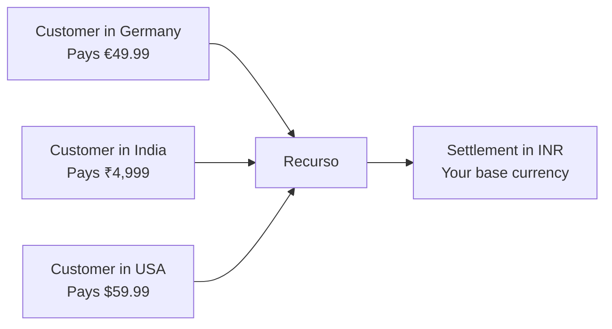

## Local Billing, Base-Currency Settlement

Recurso supports billing in multiple currencies, allowing you to charge customers in their local currency while tracking revenue and settling funds in your base currency. Currency is specified at the plan, invoice, and ledger level, giving you full control over international billing.



## Key Concepts

| Concept | Description |
|---------|-------------|
| **Presentment currency** | The currency shown to the customer on invoices and checkout |
| **Base currency** | Your company's home currency used for accounting and reporting |
| **Settlement currency** | The currency deposited into your bank account (often same as base) |
| **FX rate** | The exchange rate applied when converting between currencies |

<Info>
All monetary amounts in the Recurso API are expressed in **minor units** (e.g., cents, paise). An amount of `4999` in `INR` represents ₹49.99. An amount of `5999` in `USD` represents $59.99.
</Info>

## Setting Your Base Currency

Configure your base currency during tenant setup. This is the currency used for financial reporting and ledger balances.

<CodeGroup>

```bash cURL
# The reporting/base currency is fixed when the tenant is created and is a
# dashboard/registration setting — there is no runtime API to change it.
# The account endpoint (PUT /v1/account) updates name and email only.
```
</CodeGroup>

<Warning>
Changing your base currency after you have active subscriptions and ledger entries is not recommended. It will not retroactively convert historical data. Set this before going live.
</Warning>

## Creating Multi-Currency Plans

Plans can include prices in multiple currencies. When a subscription is created, Recurso selects the appropriate price based on the customer's currency.

A plan's flat price is **one currency**. Sell a tier in several currencies
with per-currency plan codes — the smart router then picks the gateway per
currency (₹ → Razorpay, $/€/£ → Stripe by default):

<CodeGroup>
```bash cURL
for cur_amount in "INR 499900" "USD 5999" "EUR 4999" "GBP 4999"; do
  set -- $cur_amount
  curl -X POST https://api.recurso.dev/v1/plans \
    -H "Authorization: Bearer $API_KEY" \
    -H "Content-Type: application/json" \
    -d "{
      \"name\": \"Pro Plan\",
      \"code\": \"pro-monthly-$(echo $1 | tr A-Z a-z)\",
      \"interval_unit\": \"month\",
      \"interval_count\": 1,
      \"amount\": $2,
      \"currency\": \"$1\"
    }"
done
```

```typescript Node
const currencies = [
  { code: 'pro-monthly-inr', amount: 499900, currency: 'INR' },
  { code: 'pro-monthly-usd', amount: 5999,   currency: 'USD' },
  { code: 'pro-monthly-eur', amount: 4999,   currency: 'EUR' },
];
for (const c of currencies) {
  await recurso.plans.create({
    name: 'Pro Plan',
    interval_unit: 'month',
    interval_count: 1,
    ...c,
  });
}
```
</CodeGroup>

<Tip>
Usage charges don't need per-currency plans — one charge carries a
per-currency `amounts` map, so a metered plan rates in whatever currency
the subscription bills in. See
[usage-based billing](/advanced/usage-billing).
</Tip>

## Currency on Subscriptions

When creating a subscription, the currency is determined by the customer's configured currency or can be explicitly specified:

<CodeGroup>
```typescript Node
const subscription = await recurso.subscriptions.create({
  customer_id: "cust_eu_abc",
  plan_id: "plan_pro",
  currency: "EUR"  // Explicitly set to Euro
});

// The subscription object includes the currency
// {
//   id: "sub_xyz789",
//   customer_id: "cust_eu_abc",
//   plan_id: "plan_pro",
//   currency: "EUR",
//   amount: 4999,
//   status: "active",
//   ...
// }
```

```bash cURL
curl -X POST https://api.recurso.dev/v1/subscriptions \
  -H "Authorization: Bearer $API_KEY" \
  -H "Content-Type: application/json" \
  -d '{
    "customer_id": "cust_eu_abc",
    "plan_id": "plan_pro",
    "currency": "EUR"
  }'
```
</CodeGroup>

## Currency on Invoices

Invoices inherit the currency from the subscription. All line items, taxes, and totals are expressed in the presentment currency.

```json
{
  "id": "inv_m8k29x",
  "subscription_id": "sub_xyz789",
  "customer_id": "cust_eu_abc",
  "currency": "EUR",
  "subtotal": 4999,
  "tax": 950,
  "total": 5949,
  "status": "paid",
  "line_items": [
    {
      "description": "Pro Plan — July 2025",
      "amount": 4999,
      "currency": "EUR"
    }
  ]
}
```

## How FX Rates Work

When payments in foreign currencies are received, Recurso records the exchange rate for ledger entries and reporting.

### Rate Determination

Recurso supports multiple approaches for exchange rates:

| Approach | Description | Use Case |
|----------|-------------|----------|
| **Gateway rate** | Uses the rate from your payment gateway (Stripe, Razorpay) at settlement time | Most common; reflects actual conversion |
| **Fixed rate** | You set a fixed rate per currency pair | Predictable pricing; you absorb FX risk |
| **Daily rate** | Recurso fetches rates from a provider daily | Balance of accuracy and predictability |

### Configuring FX Rate Source

The FX rate source (live provider vs. fixed rates) is a **deployment
setting**, not a runtime API — configure it via environment / dashboard,
not a `/v1` call. FX affects reporting only: invoices always bill in the
subscription's own currency, and MRR/revenue normalize to your reporting
currency at read time.

## Currency Conversion in the Ledger

The ledger posts each entry once, in the invoice's own currency's **minor
units** — a €49.99 payment posts `4999`, exactly as billed. There are no
duplicate base-currency entries and no per-currency account balances:
currency normalization happens in **reporting** (MRR, revenue analytics),
which converts to your reporting currency at read time.

### Example: EUR Payment

A customer pays €49.99 for a subscription:

```text
  Debit   1000 (Cash)                 4999   (EUR minor units)
  Credit  1100 (Accounts Receivable)  4999
```

<Info>
Keep an eye on currency exponents: JPY has none (¥500 posts as `500`),
KWD/BHD have three. Recurso stores every amount in the currency's own
minor units.
</Info>

## Reporting in Base Currency

All financial reports aggregate to your base currency, giving you a single unified view regardless of how many currencies you bill in.

### Revenue by Currency

<CodeGroup>
```typescript Node
// MRR, FX-normalized to your reporting currency at read time
const { data } = await recurso.analytics.mrr();
```

```bash cURL
curl https://api.recurso.dev/v1/analytics/mrr \
  -H "Authorization: Bearer $API_KEY"
```
</CodeGroup>

The ledger itself stays in each invoice's own currency — conversion is a
reporting concern, so use the analytics endpoints (revenue by plan /
geography, MRR) for base-currency views.

### Breakdown by Presentment Currency

To see deferred revenue broken down by the currencies your customers pay
in, the revenue-recognition report returns a per-currency split directly:

```typescript
// GET /v1/finance/revrec/report?month=6&year=2026 -> data.by_currency
const res = await fetch(
  'https://api.recurso.dev/v1/finance/revrec/report?month=6&year=2026',
  { headers: { Authorization: `Bearer ${process.env.RECURSO_API_KEY}` } },
);
const { data } = await res.json();
console.log(data.by_currency); // [{ currency: 'EUR', deferred: 449900 }, ...]
```

## Supported Currencies

Recurso supports all ISO 4217 currencies. Common currencies used by customers:

| Currency | Code | Minor Units | Symbol |
|----------|------|-------------|--------|
| Indian Rupee | `INR` | 100 (paise) | ₹ |
| US Dollar | `USD` | 100 (cents) | $ |
| Euro | `EUR` | 100 (cents) | € |
| British Pound | `GBP` | 100 (pence) | £ |
| Singapore Dollar | `SGD` | 100 (cents) | S$ |
| UAE Dirham | `AED` | 100 (fils) | د.إ |
| Japanese Yen | `JPY` | 1 (no minor) | ¥ |

<Warning>
Zero-decimal currencies like `JPY` have no minor unit. An amount of `5999` in JPY represents ¥5,999 — not ¥59.99. Recurso handles this automatically based on the ISO 4217 exponent, but be careful when constructing amounts in your application.
</Warning>

## Handling FX Gains and Losses

Because both the invoice and its payment post in the invoice's own currency,
no FX gain or loss ever arises inside the ledger — the receivable and the
cash that settles it are the same number of minor units. Rate movement
between invoicing and payment shows up only in **reports**, which convert at
read time. If you book realized FX gains/losses for statutory accounts, do
it in your accounting system from the GL export, using your own rate policy.

## Best Practices

<CardGroup cols={2}>
  <Card title="Define All Prices Upfront" icon="tags">
    Add prices for every currency you support when creating a plan. This avoids subscription creation failures.
  </Card>
  <Card title="Use Gateway Rates" icon="building-columns">
    Gateway FX rates reflect what you actually receive after conversion, eliminating discrepancies between billed and settled amounts.
  </Card>
  <Card title="Monitor FX Exposure" icon="chart-line">
    Track your receivables by currency. Large balances in volatile currencies increase FX risk.
  </Card>
  <Card title="Handle Zero-Decimal Currencies" icon="yen-sign">
    Validate your amount logic for currencies like JPY and KRW that have no minor unit.
  </Card>
</CardGroup>

<Tip>
If you only serve customers in one country, you can skip multi-currency entirely. Just set your base currency and define a single price on each plan. Multi-currency features activate only when you add prices in additional currencies.
</Tip>
