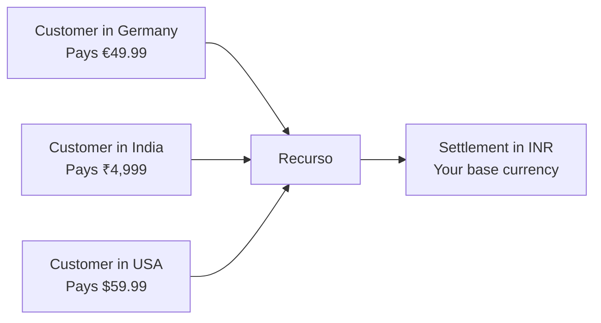

## Overview

Recurso supports billing in multiple currencies, allowing you to charge customers in their local currency while tracking revenue and settling funds in your base currency. Currency is specified at the plan, subscription, and invoice level; the ledger itself is kept in a single reporting currency and foreign amounts are normalized at read time.



## Key Concepts

| Concept | Description |
|---------|-------------|
| **Presentment currency** | The currency shown to the customer on invoices and checkout |
| **Base currency** | Your company's home currency used for accounting and reporting |
| **Settlement currency** | The currency deposited into your bank account (often same as base) |
| **FX rate** | The exchange rate applied when converting between currencies |

<Info>
All monetary amounts in the Recurso API are expressed in **minor units** (e.g., cents, paise). An amount of `4999` in `INR` represents ₹49.99. An amount of `5999` in `USD` represents $59.99.
</Info>

## Setting Your Base Currency

Configure your base currency during tenant setup. This is the currency used for financial reporting and ledger balances.

<CodeGroup>

```bash cURL
# The reporting/base currency is fixed when the tenant is created and is a
# dashboard/registration setting — there is no runtime API to change it.
# The account endpoint (PUT /v1/account) updates name and email only.
```
</CodeGroup>

<Warning>
Changing your base currency after you have active subscriptions and ledger entries is not recommended. It will not retroactively convert historical data. Set this before going live.
</Warning>

## Creating Multi-Currency Plans

Plans can include prices in multiple currencies. When a subscription is created, Recurso selects the appropriate price based on the customer's currency.

A plan's flat price is **one currency**. Sell a tier in several currencies
with per-currency plan codes — the smart router then picks the gateway per
currency (₹ → Razorpay, $/€/£ → Stripe by default):

<CodeGroup>
```bash cURL
for cur_amount in "INR 499900" "USD 5999" "EUR 4999" "GBP 4999"; do
  set -- $cur_amount
  curl -X POST https://api.recurso.dev/v1/plans \
    -H "Authorization: Bearer $API_KEY" \
    -H "Content-Type: application/json" \
    -d "{
      \"name\": \"Pro Plan\",
      \"code\": \"pro-monthly-$(echo $1 | tr A-Z a-z)\",
      \"interval_unit\": \"month\",
      \"interval_count\": 1,
      \"amount\": $2,
      \"currency\": \"$1\"
    }"
done
```

```typescript Node
const currencies = [
  { code: 'pro-monthly-inr', amount: 499900, currency: 'INR' },
  { code: 'pro-monthly-usd', amount: 5999,   currency: 'USD' },
  { code: 'pro-monthly-eur', amount: 4999,   currency: 'EUR' },
];
for (const c of currencies) {
  await recurso.plans.create({
    name: 'Pro Plan',
    interval_unit: 'month',
    interval_count: 1,
    ...c,
  });
}
```
</CodeGroup>

<Tip>
Usage charges don't need per-currency plans — one charge carries a
per-currency `amounts` map, so a metered plan rates in whatever currency
the subscription bills in. See
[usage-based billing](/advanced/usage-billing).
</Tip>

## Currency on Subscriptions

When creating a subscription, the currency is determined by the customer's configured currency or can be explicitly specified:

<CodeGroup>
```typescript TypeScript
const subscription = await recurso.subscriptions.create({
  customer_id: "cust_eu_abc",
  plan_id: "plan_pro",
  currency: "EUR"  // Explicitly set to Euro
});

// The subscription object includes the currency
// {
//   id: "sub_xyz789",
//   customer_id: "cust_eu_abc",
//   plan_id: "plan_pro",
//   currency: "EUR",
//   amount: 4999,
//   status: "active",
//   ...
// }
```

```bash cURL
curl -X POST https://api.recurso.dev/v1/subscriptions \
  -H "Authorization: Bearer $API_KEY" \
  -H "Content-Type: application/json" \
  -d '{
    "customer_id": "cust_eu_abc",
    "plan_id": "plan_pro",
    "currency": "EUR"
  }'
```
</CodeGroup>

## Currency on Invoices

Invoices inherit the currency from the subscription. All line items, taxes, and totals are expressed in the presentment currency.

```json
{
  "id": "inv_m8k29x",
  "subscription_id": "sub_xyz789",
  "customer_id": "cust_eu_abc",
  "currency": "EUR",
  "subtotal": 4999,
  "tax": 950,
  "total": 5949,
  "status": "paid",
  "line_items": [
    {
      "description": "Pro Plan — July 2025",
      "amount": 4999,
      "currency": "EUR"
    }
  ]
}
```

## How FX Rates Work

When payments in foreign currencies are received, Recurso records the exchange rate for ledger entries and reporting.

### Rate Determination

Recurso supports multiple approaches for exchange rates:

| Approach | Description | Use Case |
|----------|-------------|----------|
| **Gateway rate** | Uses the rate from your payment gateway (Stripe, Razorpay) at settlement time | Most common; reflects actual conversion |
| **Fixed rate** | You set a fixed rate per currency pair | Predictable pricing; you absorb FX risk |
| **Daily rate** | Recurso fetches rates from a provider daily | Balance of accuracy and predictability |

### Configuring FX Rate Source

The FX rate source (live provider vs. fixed rates) is a **deployment
setting**, not a runtime API — configure it via environment / dashboard,
not a `/v1` call. FX affects reporting only: invoices always bill in the
subscription's own currency, and MRR/revenue normalize to your reporting
currency at read time.

## Currency Conversion in the Ledger

The ledger is kept in a **single reporting currency**. A posting stores no
per-transaction currency of its own — a foreign-currency invoice or payment is
converted at the applicable FX rate and booked once, in your reporting currency.
There are no parallel "presentment-currency" ledger entries.

### Example: EUR Payment with INR Reporting Currency

A customer pays €49.99 for a subscription. The FX rate is 1 EUR = 90.75 INR, so
the payment is booked as ₹4,536.59 — a single transfer (posting `code` `3`):

```
Payment received (€49.99 → ₹4,536.59):
  Debit   1000 (Cash)                 ₹4,536.59
  Credit  1100 (Accounts Receivable)  ₹4,536.59
```

<Info>
The presentment amount (€49.99) lives on the **invoice and payment** records, not
in the ledger. Query those objects when you need the original billed currency; the
ledger always answers in your reporting currency.
</Info>

## Reporting in Base Currency

All financial reports aggregate to your base currency, giving you a single unified view regardless of how many currencies you bill in.

### Revenue by Currency

<CodeGroup>
```typescript TypeScript
const accounts = await recurso.ledger.accounts.list();
const revenueAccount = accounts.data.find(a => a.code === "4000");

// Revenue account balance is always in base currency
console.log(`Total Revenue: ${revenueAccount.currency} ${revenueAccount.balance / 100}`);
// Total Revenue: INR 1250000.00
```

```bash cURL
curl https://api.recurso.dev/v1/ledger/accounts \
  -H "Authorization: Bearer $API_KEY"

# The revenue account (code 4000) balance reflects
# all revenue converted to your base currency
```
</CodeGroup>

### Breakdown by Presentment Currency

The ledger cannot answer this — it holds only reporting-currency amounts with no
per-transaction currency. To see revenue by the currency your customers actually
paid in, group the **invoices** (each carries its own `currency`), not ledger
entries:

```typescript
// List invoices and group paid ones by their presentment currency.
// (The list endpoint filters by customer_id / subscription_id only, so
//  filter on status client-side.)
const invoices = await recurso.invoices.list();

const byCurrency: Record<string, number> = {};
invoices.data
  .filter(inv => inv.status === "paid")
  .forEach(inv => {
    byCurrency[inv.currency] = (byCurrency[inv.currency] || 0) + inv.total;
  });

console.log(byCurrency);
// { INR: 15000000, USD: 119980, EUR: 49990 }  // each in that currency's minor units
```

<Note>
  Because each figure is in its own currency's minor units, don't sum across
  currencies — convert to your reporting currency first (or read the already-
  normalized total from the ledger / analytics).
</Note>

## Supported Currencies

Recurso supports all ISO 4217 currencies. Common currencies used by customers:

| Currency | Code | Minor Units | Symbol |
|----------|------|-------------|--------|
| Indian Rupee | `INR` | 100 (paise) | ₹ |
| US Dollar | `USD` | 100 (cents) | $ |
| Euro | `EUR` | 100 (cents) | € |
| British Pound | `GBP` | 100 (pence) | £ |
| Singapore Dollar | `SGD` | 100 (cents) | S$ |
| UAE Dirham | `AED` | 100 (fils) | د.إ |
| Japanese Yen | `JPY` | 1 (no minor) | ¥ |

<Warning>
Zero-decimal currencies like `JPY` have no minor unit. An amount of `5999` in JPY represents ¥5,999 — not ¥59.99. Recurso handles this automatically based on the ISO 4217 exponent, but be careful when constructing amounts in your application.
</Warning>

## Handling FX Gains and Losses

Exchange rates can move between the time an invoice is issued and the time it is
paid. Recurso does **not** post a realized FX gain/loss to a dedicated ledger
account — there is no `4500 FX Gain` account, and the transfer-based ledger never
records a multi-leg compound entry. FX is a **read-time reporting** concern:
foreign amounts are normalized to your reporting currency when MRR, revenue, and
receivables are computed, using the applicable rate.

If you need formal FX gain/loss accounting for statutory books, export the ledger
and the underlying invoice/payment currencies (each object carries its own
`currency`) and recognize the difference in your general ledger of record.

## Best Practices

<CardGroup cols={2}>
  <Card title="Define All Prices Upfront" icon="tags">
    Add prices for every currency you support when creating a plan. This avoids subscription creation failures.
  </Card>
  <Card title="Use Gateway Rates" icon="building-columns">
    Gateway FX rates reflect what you actually receive after conversion, eliminating discrepancies between billed and settled amounts.
  </Card>
  <Card title="Monitor FX Exposure" icon="chart-line">
    Track your receivables by currency. Large balances in volatile currencies increase FX risk.
  </Card>
  <Card title="Handle Zero-Decimal Currencies" icon="yen-sign">
    Validate your amount logic for currencies like JPY and KRW that have no minor unit.
  </Card>
</CardGroup>

<Tip>
If you only serve customers in one country, you can skip multi-currency entirely. Just set your base currency and define a single price on each plan. Multi-currency features activate only when you add prices in additional currencies.
</Tip>
