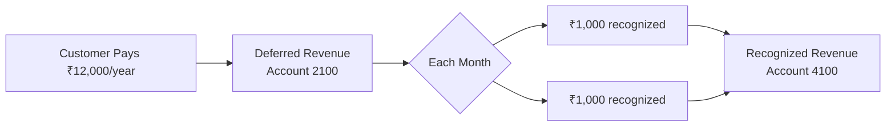
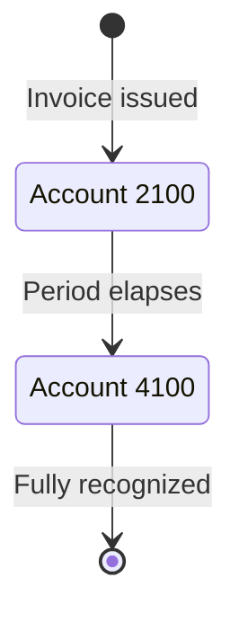

<Info>
  This page explains the concepts. To turn it on step by step, follow the [revenue-recognition setup guide](/setup/revenue-recognition).
</Info>

## Overview

Revenue recognition determines when earned income is recorded on your books. For SaaS businesses, you cannot recognize the full value of an annual subscription upfront — it must be spread across the service period. Recurso automates this process using its built-in double-entry ledger.



### Why This Matters

- **ASC 606 / IFRS 15 compliance** — Public and venture-backed companies must follow these standards.
- **Accurate financials** — Revenue is matched to the period in which service is delivered.
- **Investor-ready reporting** — Monthly Recurring Revenue (MRR) and Annual Recurring Revenue (ARR) reflect true earned revenue.
- **Audit readiness** — Every recognition event produces a traceable journal entry.

## ASC 606 Five-Step Model

Recurso implements the core ASC 606 framework automatically:

<Steps>
  <Step title="Identify the Contract">
    A subscription is created between a customer and your business. The subscription object (`sub_`) serves as the contract.
  </Step>
  <Step title="Identify Performance Obligations">
    Each billing period represents a distinct performance obligation — the promise to provide service for that period.
  </Step>
  <Step title="Determine Transaction Price">
    The plan price, adjusted for any coupons or discounts, determines the transaction price. This is stored on the invoice (`inv_`).
  </Step>
  <Step title="Allocate to Performance Obligations">
    For monthly subscriptions, the full invoice amount maps to one period. For annual subscriptions, the amount is divided equally across 12 months.
  </Step>
  <Step title="Recognize Revenue Over Time">
    Recurso creates scheduled journal entries that move amounts from Deferred Revenue (account `2100`) to Recognized Revenue (account `4100`) as each period completes.
  </Step>
</Steps>

## How Recurso Handles Revenue Schedules

When a subscription invoice is paid, Recurso creates a revenue recognition schedule based on the subscription interval and the amount paid.

### Monthly Subscription

For a monthly plan at ₹4,999/month, the invoice books deferred revenue on
issuance, the payment clears the receivable, and recognition earns it at the end
of the billing period because the service period matches the billing period:

```
On issuance (Jan 1) — posting code 1:
  Debit   1100 (Accounts Receivable) ₹4,999.00
  Credit  2100 (Deferred Revenue)    ₹4,999.00

On payment (Jan 1) — posting code 3:
  Debit   1000 (Cash)                ₹4,999.00
  Credit  1100 (Accounts Receivable) ₹4,999.00

On period end (Jan 31) — posting code 2:
  Debit   2100 (Deferred Revenue)    ₹4,999.00
  Credit  4100 (Recognized Revenue)  ₹4,999.00
```

### Annual Subscription

For an annual plan at ₹49,990/year (equivalent to ₹4,165.83/month), revenue is recognized in 12 equal installments:

```
On issuance (Jan 1) — code 1:
  Debit   1100 (Accounts Receivable) ₹49,990.00
  Credit  2100 (Deferred Revenue)    ₹49,990.00

On payment (Jan 1) — code 3:
  Debit   1000 (Cash)                ₹49,990.00
  Credit  1100 (Accounts Receivable) ₹49,990.00

End of January — code 2:
  Debit   2100 (Deferred Revenue)    ₹4,165.83
  Credit  4100 (Recognized Revenue)  ₹4,165.83

End of February — code 2:
  Debit   2100 (Deferred Revenue)    ₹4,165.83
  Credit  4100 (Recognized Revenue)  ₹4,165.83

... (repeated each month through December)

End of December — code 2:
  Debit   2100 (Deferred Revenue)    ₹4,165.87
  Credit  4100 (Recognized Revenue)  ₹4,165.87
```

<Info>
The final month absorbs any rounding difference to ensure the schedule totals exactly match the original payment amount. In the example above, the last installment is ₹4,165.87 instead of ₹4,165.83 to account for the 4-cent remainder.
</Info>

### Quarterly Subscription

For a quarterly plan at ₹13,499/quarter, revenue is recognized over 3 months:

```
On issuance (Jan 1) — code 1:
  Debit   1100 (Accounts Receivable) ₹13,499.00
  Credit  2100 (Deferred Revenue)    ₹13,499.00

On payment (Jan 1) — code 3:
  Debit   1000 (Cash)                ₹13,499.00
  Credit  1100 (Accounts Receivable) ₹13,499.00

End of January — code 2:
  Debit   2100 (Deferred Revenue)    ₹4,499.67
  Credit  4100 (Recognized Revenue)  ₹4,499.67

End of February — code 2:
  Debit   2100 (Deferred Revenue)    ₹4,499.67
  Credit  4100 (Recognized Revenue)  ₹4,499.67

End of March — code 2:
  Debit   2100 (Deferred Revenue)    ₹4,499.66
  Credit  4100 (Recognized Revenue)  ₹4,499.66
```

## Key Accounts

Revenue recognition uses two primary ledger accounts:

| Account | Code | Type | Role |
|---------|------|------|------|
| Deferred Revenue | `2100` | `liability` | Holds billed amounts until the service period elapses |
| Recognized Revenue | `4100` | `revenue` | Records income as each period is earned |

The flow is always the same: an invoice books the amount into Deferred Revenue on
issuance, then it moves to Recognized Revenue as the obligation is fulfilled. (Account
`4000` Revenue is used for one-off charges, which are earned on issuance and never pass
through Deferred Revenue.)



## Revenue Recognition Report

The `GET /v1/finance/revrec/report` endpoint provides a consolidated revenue recognition report for a given period. It returns both recognized and deferred amounts, broken down by subscription.

<CodeGroup>

```bash cURL
curl -G https://api.recurso.dev/v1/finance/revrec/report \
  -H "Authorization: Bearer $API_KEY" \
  -d start_date=2026-01-01 \
  -d end_date=2026-06-30
```
</CodeGroup>

### Report Fields

| Field | Description |
|-------|-------------|
| `recognized_amount` | Revenue that has been earned and moved from Deferred Revenue (2100) to Recognized Revenue (4100) during the period |
| `deferred_amount` | Revenue collected but not yet earned — still sitting in Deferred Revenue (2100) at the end of the period |
| `total_recognized_amount` | Sum of `recognized_amount` across all subscriptions |
| `total_deferred_amount` | Sum of `deferred_amount` across all subscriptions |

## Querying Revenue Data

Use the ledger API to retrieve recognition entries for reporting.

### Deferred Revenue Balance

<CodeGroup>
```typescript TypeScript
const accounts = await recurso.ledger.accounts.list();
const deferred = accounts.data.find(a => a.code === "2100");

console.log(`Deferred Revenue: ${deferred.currency} ${deferred.balance / 100}`);
// Deferred Revenue: INR 124975.00
```

```bash cURL
curl https://api.recurso.dev/v1/ledger/accounts \
  -H "Authorization: Bearer $API_KEY"

# Filter for account code 2100 in the response
```
</CodeGroup>

### Recognition Entries

Recognition postings land in **Recognized Revenue** (`4100`). List that account's
postings — the entries endpoint has no date filters, so filter by `created_at`
client-side, or use the revrec report / GL export for period totals:

<CodeGroup>
```typescript TypeScript
const entries = await recurso.ledger.entries.list({
  account_id: "lacc_recrev4100",
  code: 2,          // recognition postings only
  limit: 100
});

// Each row is a single transfer: one recognized period for one subscription
entries.data
  .filter(txn => txn.created_at >= "2025-06-01" && txn.created_at <= "2025-06-30")
  .forEach(txn => {
    console.log(`${txn.created_at}: ${txn.amount / 100} — ${txn.description}`);
  });
```

```bash cURL
curl "https://api.recurso.dev/v1/ledger/entries?account_id=lacc_recrev4100&code=2&limit=100" \
  -H "Authorization: Bearer $API_KEY"
```
</CodeGroup>

<Tip>
  For period totals, prefer `GET /v1/finance/revrec/report` (above) — it already
  aggregates recognized and deferred amounts for a date range, so you don't have
  to page and sum ledger postings yourself.
</Tip>

## Handling Edge Cases

<AccordionGroup>
  <Accordion title="Mid-cycle cancellations">
    When a subscription is canceled mid-period with a refund, the unearned
    deferred revenue is reversed (posting code `5`) and the cash refund is paid
    out (posting code `4`) — two single transfers, not one:

    ```
    Code 5  Debit   2100 (Deferred Revenue)  ₹33,327.00  (8 remaining months)
            Credit  5000 (Refunds)           ₹33,327.00

    Code 4  Debit   5000 (Refunds)           ₹33,327.00
            Credit  1000 (Cash)              ₹33,327.00
    ```

    If no refund is issued (cancel at end of period), the remaining deferred revenue is recognized as earned at the cancellation date per your refund policy.
  </Accordion>

  <Accordion title="Plan upgrades and downgrades">
    When a customer changes plans mid-cycle, Recurso:

    1. Reverses remaining deferred revenue from the old plan
    2. Creates a new deferred revenue entry for the prorated new plan amount
    3. Adjusts the recognition schedule going forward

    This ensures revenue reflects the actual service delivered at each price point.
  </Accordion>

  <Accordion title="Refunds">
    Refunds create a reversal entry that reduces both Cash and Revenue (or Deferred Revenue if the period has not yet been recognized):

    ```
    Debit   5000 (Refunds)             ₹4,999.00
    Credit  1000 (Cash)                ₹4,999.00
    ```
  </Accordion>

  <Accordion title="Discounts and coupons">
    Discounts reduce the transaction price *before* any posting is made. A ₹49,990
    annual plan with a 20% discount produces an invoice for ₹39,992, so the Code-1
    issuance transfer books ₹39,992 to Deferred Revenue and the recognition schedule
    is built on that amount. There is **no** separate discount posting — the ledger
    never sees the ₹9,998; it only ever books the discounted total.
  </Accordion>

  <Accordion title="Free trials">
    During a free trial, no revenue is deferred or recognized. Revenue recognition begins only when the first paid invoice is generated after the trial ends.
  </Accordion>
</AccordionGroup>

## Webhook Events

Subscribe to these events for revenue tracking:

| Event | Description |
|-------|-------------|
| `invoice.paid` | A subscription invoice was paid — its recognition schedule is now active |
| `subscription.canceled` | May trigger a deferred revenue reversal |

<Note>
  There is no `ledger.entry.created` (or any `ledger.*`) event. Recognition
  happens on a schedule inside Recurso and does not emit its own webhook — read
  recognized amounts from the [revrec report](#revenue-recognition-report) or the
  ledger API instead. See the full [event list](/api-reference/webhooks/events).
</Note>

## Building Revenue Reports

### Monthly Recognized Revenue

The cleanest source is the revrec report (`GET /v1/finance/revrec/report`), which
takes a date range and returns `total_recognized_amount` directly. If you'd rather
sum ledger postings, list **Recognized Revenue** (`4100`) — the entries endpoint has
no date filter, so bound the period on `created_at` in your own code, and each row
is a single transfer (no nested `entries[]`):

```typescript
async function getMonthlyRevenue(year: number, month: number) {
  const startDate = `${year}-${String(month).padStart(2, '0')}-01`;
  const endDate = new Date(year, month, 0).toISOString().split('T')[0];

  const entries = await recurso.ledger.entries.list({
    account_id: "lacc_recrev4100",
    code: 2,          // recognition postings
    limit: 1000
  });

  const totalRecognized = entries.data
    .filter(txn => txn.created_at >= startDate && txn.created_at <= `${endDate}T23:59:59Z`)
    .reduce((sum, txn) => sum + txn.amount, 0);

  return totalRecognized; // in minor units
}
```

### Deferred Revenue Waterfall

Track how deferred revenue unwinds over time by querying account `2100` balance at the end of each month. This creates a waterfall chart showing your future revenue obligations.

## Best Practices

<CardGroup cols={2}>
  <Card title="Match Billing to Service" icon="calendar">
    Choose billing intervals that align with how you deliver value. Monthly billing is simplest for recognition.
  </Card>
  <Card title="Reconcile Monthly" icon="scale-balanced">
    Verify that Deferred Revenue + Recognized Revenue equals total cash collected for each cohort of subscriptions.
  </Card>
  <Card title="Automate Reporting" icon="chart-line">
    Use the ledger API and revrec report endpoint to build automated revenue reports rather than manual spreadsheets.
  </Card>
  <Card title="Plan for Audits" icon="magnifying-glass">
    Keep ledger entries immutable and use reference IDs to trace every recognition entry back to its source invoice and subscription.
  </Card>
</CardGroup>

<Warning>
Revenue recognition rules vary by jurisdiction and business model. While Recurso automates the mechanical process, consult your accountant or auditor to confirm the recognition policies match your specific requirements.
</Warning>
