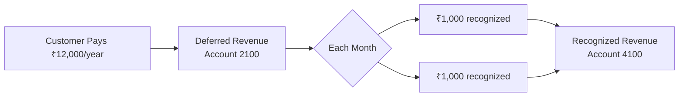
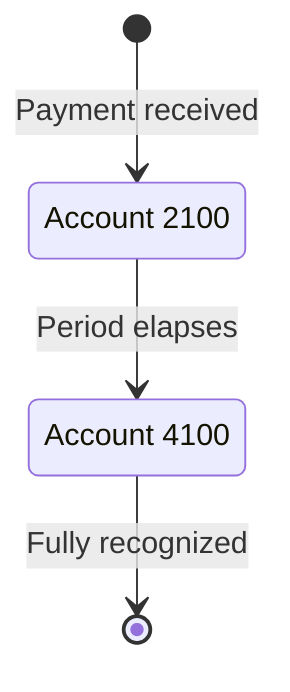

<Info>
  This page explains the concepts. To turn it on step by step, follow the [revenue-recognition setup guide](/setup/revenue-recognition).
</Info>

## Overview

Revenue recognition determines when earned income is recorded on your books. For SaaS businesses, you cannot recognize the full value of an annual subscription upfront — it must be spread across the service period. Recurso automates this process using its built-in double-entry ledger.



### Why This Matters

- **ASC 606 / IFRS 15 compliance** — Public and venture-backed companies must follow these standards.
- **Accurate financials** — Revenue is matched to the period in which service is delivered.
- **Investor-ready reporting** — Monthly Recurring Revenue (MRR) and Annual Recurring Revenue (ARR) reflect true earned revenue.
- **Audit readiness** — Every recognition event produces a traceable journal entry.

## ASC 606 Five-Step Model

Recurso implements the core ASC 606 framework automatically:

<Steps>
  <Step title="Identify the Contract">
    A subscription is created between a customer and your business. The subscription object (`sub_`) serves as the contract.
  </Step>
  <Step title="Identify Performance Obligations">
    Each billing period represents a distinct performance obligation — the promise to provide service for that period.
  </Step>
  <Step title="Determine Transaction Price">
    The plan price, adjusted for any coupons or discounts, determines the transaction price. This is stored on the invoice (`inv_`).
  </Step>
  <Step title="Allocate to Performance Obligations">
    For monthly subscriptions, the full invoice amount maps to one period. For annual subscriptions, the amount is divided equally across 12 months.
  </Step>
  <Step title="Recognize Revenue Over Time">
    Recurso creates scheduled journal entries that move amounts from Deferred Revenue (account `2100`) to Recognized Revenue (account `4100`) as each period completes.
  </Step>
</Steps>

## How Recurso Handles Revenue Schedules

When a subscription invoice is paid, Recurso creates a revenue recognition schedule based on the subscription interval and the amount paid.

### Monthly Subscription

For a monthly plan at ₹4,999/month, revenue is recognized immediately at the end of the billing period because the service period matches the billing period:

```text
On invoice (Jan 1):
  Debit   1100 (Accounts Receivable) ₹4,999.00
  Credit  2100 (Deferred Revenue)    ₹4,999.00

On payment (Jan 1):
  Debit   1000 (Cash)                ₹4,999.00
  Credit  1100 (Accounts Receivable) ₹4,999.00

On period end (Jan 31):
  Debit   2100 (Deferred Revenue)    ₹4,999.00
  Credit  4100 (Recognized Revenue)  ₹4,999.00
```

### Annual Subscription

For an annual plan at ₹49,990/year (equivalent to ₹4,165.83/month), revenue is recognized in 12 equal installments:

```text
On invoice (Jan 1):
  Debit   1100 (Accounts Receivable) ₹49,990.00
  Credit  2100 (Deferred Revenue)    ₹49,990.00

On payment (Jan 1):
  Debit   1000 (Cash)                ₹49,990.00
  Credit  1100 (Accounts Receivable) ₹49,990.00

End of January:
  Debit   2100 (Deferred Revenue)    ₹4,165.83
  Credit  4100 (Recognized Revenue)             ₹4,165.83

End of February:
  Debit   2100 (Deferred Revenue)    ₹4,165.83
  Credit  4100 (Recognized Revenue)             ₹4,165.83

... (repeated each month through December)

End of December:
  Debit   2100 (Deferred Revenue)    ₹4,165.87
  Credit  4100 (Recognized Revenue)             ₹4,165.87
```

<Info>
The final month absorbs any rounding difference to ensure the schedule totals exactly match the original payment amount. In the example above, the last installment is ₹4,165.87 instead of ₹4,165.83 to account for the 4-cent remainder.
</Info>

### Quarterly Subscription

For a quarterly plan at ₹13,499/quarter, revenue is recognized over 3 months:

```text
On invoice (Jan 1):
  Debit   1100 (Accounts Receivable) ₹13,499.00
  Credit  2100 (Deferred Revenue)    ₹13,499.00

On payment (Jan 1):
  Debit   1000 (Cash)                ₹13,499.00
  Credit  1100 (Accounts Receivable) ₹13,499.00

End of January:
  Debit   2100 (Deferred Revenue)    ₹4,499.67
  Credit  4100 (Recognized Revenue)             ₹4,499.67

End of February:
  Debit   2100 (Deferred Revenue)    ₹4,499.67
  Credit  4100 (Recognized Revenue)             ₹4,499.67

End of March:
  Debit   2100 (Deferred Revenue)    ₹4,499.66
  Credit  4100 (Recognized Revenue)             ₹4,499.66
```

## Key Accounts

Revenue recognition uses two primary ledger accounts:

| Account | Code | Type | Role |
|---------|------|------|------|
| Deferred Revenue | `2100` | `liability` | Holds prepaid amounts until the service period elapses |
| Recognized Revenue | `4100` | `revenue` | Records subscription income as it is earned |

The flow is always the same: money enters Deferred Revenue when collected, then moves to Revenue as the obligation is fulfilled.



## Revenue Recognition Report

The `GET /v1/finance/revrec/report` endpoint provides a consolidated revenue recognition report for a given period. It returns both recognized and deferred amounts, broken down by subscription.

<CodeGroup>

```bash cURL
curl -G https://api.recurso.dev/v1/finance/revrec/report \
  -H "Authorization: Bearer $API_KEY" \
  -d month=6 \
  -d year=2026
```
</CodeGroup>

### Report Fields

| Field | Description |
|-------|-------------|
| `recognized_amount` | Revenue earned in the requested month — moved from Deferred Revenue (2100) to Recognized Revenue (4100), in minor units |
| `deferred_balance` | Revenue billed but not yet earned — still sitting in Deferred Revenue (2100), summed across currencies |
| `upcoming` | The still-deferred balance grouped by the future month it is scheduled to recognize |
| `by_currency` | The deferred balance split by each schedule's own currency |

## Querying Revenue Data

Use the ledger API to retrieve recognition entries for reporting.

### Deferred Revenue Balance

<CodeGroup>
```typescript TypeScript
const accounts = await recurso.ledger.accounts.list();
const deferred = accounts.data.find(a => a.code === "2100");

console.log(`Deferred Revenue: ${deferred.currency} ${deferred.balance / 100}`);
// Deferred Revenue: INR 124975.00
```

```bash cURL
curl https://api.recurso.dev/v1/ledger/accounts \
  -H "Authorization: Bearer $API_KEY"

# Filter for account code 2100 in the response
```
</CodeGroup>

### Monthly Recognition Entries

<CodeGroup>
```typescript TypeScript
// Find the Recognized Revenue (4100) account, then list its postings.
// code 2 = revenue-recognition postings; page with limit/offset.
const { data: accounts } = await recurso.ledger.accounts();
const recognized = accounts.find(a => a.code === 4100);

const { data: entries } = await recurso.ledger.entries({
  account_id: recognized.id,
  code: 2,
});

entries.forEach(entry => {
  console.log(`${entry.created_at}: ${entry.amount} — ${entry.description}`);
});
```

```bash cURL
curl "https://api.recurso.dev/v1/ledger/entries?account_id=<recognized-revenue-account-uuid>&code=2" \
  -H "Authorization: Bearer $API_KEY"
```
</CodeGroup>

## Handling Edge Cases

<AccordionGroup>
  <Accordion title="Mid-cycle cancellations">
    When a subscription is canceled mid-period, any remaining deferred revenue for future months is reversed:

    ```text
    Debit   5000 (Refunds)             ₹33,327.00  (money out)
    Credit  1000 (Cash)                ₹33,327.00

    Debit   2100 (Deferred Revenue)    ₹33,327.00  (unearned balance released)
    Credit  5000 (Refunds)             ₹33,327.00
    ```

    The two transfers net the Refunds account to zero when the refund is
    fully covered by unearned revenue — cash goes out, the deferred
    liability is extinguished, and no earned revenue is touched. If no
    refund is issued (cancel at end of period), the remaining deferred
    revenue simply finishes recognizing per your refund policy.
  </Accordion>

  <Accordion title="Plan upgrades and downgrades">
    When a customer changes plans mid-cycle, Recurso:

    1. Reverses remaining deferred revenue from the old plan
    2. Creates a new deferred revenue entry for the prorated new plan amount
    3. Adjusts the recognition schedule going forward

    This ensures revenue reflects the actual service delivered at each price point.
  </Accordion>

  <Accordion title="Refunds">
    A refund posts two transfers: money out, then the unearned balance
    released against the Refunds account:

    ```text
    Debit   5000 (Refunds)             ₹4,999.00
    Credit  1000 (Cash)                ₹4,999.00

    Debit   2100 (Deferred Revenue)    ₹4,999.00
    Credit  5000 (Refunds)             ₹4,999.00
    ```
  </Accordion>

  <Accordion title="Discounts and coupons">
    Discounts reduce the transaction price before the recognition schedule is created. A ₹49,990 annual plan with a 20% discount creates a schedule based on ₹39,992 spread across 12 months. There is no separate discount posting — the invoice entry (Code 1) simply posts the smaller discounted gross, so the ledger and the schedule agree by construction.
  </Accordion>

  <Accordion title="Free trials">
    During a free trial, no revenue is deferred or recognized. Revenue recognition begins only when the first paid invoice is generated after the trial ends.
  </Accordion>
</AccordionGroup>

## Webhook Events

There is no `ledger.*` event type — recognition postings happen inside
Recurso on schedule. The two real events relevant to revenue tracking:

| Event | Description |
|-------|-------------|
| `invoice.paid` | The invoice settled — its recognition schedule is built at this point |
| `subscription.canceled` | May trigger deferred-revenue reversal |

## Building Revenue Reports

### Monthly Recognized Revenue

The report endpoint answers this directly — no ledger arithmetic needed
(the SDKs don't wrap it yet; call it over HTTP):

```typescript
async function getMonthlyRevenue(year: number, month: number) {
  const res = await fetch(
    `https://api.recurso.dev/v1/finance/revrec/report?month=${month}&year=${year}`,
    { headers: { Authorization: `Bearer ${process.env.RECURSO_API_KEY}` } },
  );
  const { data } = await res.json();
  return data.recognized_amount; // in minor units
}
```

For posting-level detail, list the Recognized Revenue (4100) account's
Code-2 entries and page through them — the ledger has no date filter, so
sum client-side by `created_at`.

### Deferred Revenue Waterfall

Track how deferred revenue unwinds over time by querying account `2100` balance at the end of each month. This creates a waterfall chart showing your future revenue obligations.

## Best Practices

<CardGroup cols={2}>
  <Card title="Match Billing to Service" icon="calendar">
    Choose billing intervals that align with how you deliver value. Monthly billing is simplest for recognition.
  </Card>
  <Card title="Reconcile Monthly" icon="scale-balanced">
    Verify that Deferred Revenue + Recognized Revenue equals total cash collected for each cohort of subscriptions.
  </Card>
  <Card title="Automate Reporting" icon="chart-line">
    Use the ledger API and revrec report endpoint to build automated revenue reports rather than manual spreadsheets.
  </Card>
  <Card title="Plan for Audits" icon="magnifying-glass">
    Keep ledger entries immutable and use reference IDs to trace every recognition entry back to its source invoice and subscription.
  </Card>
</CardGroup>

<Warning>
Revenue recognition rules vary by jurisdiction and business model. While Recurso automates the mechanical process, consult your accountant or auditor to confirm the recognition policies match your specific requirements.
</Warning>
